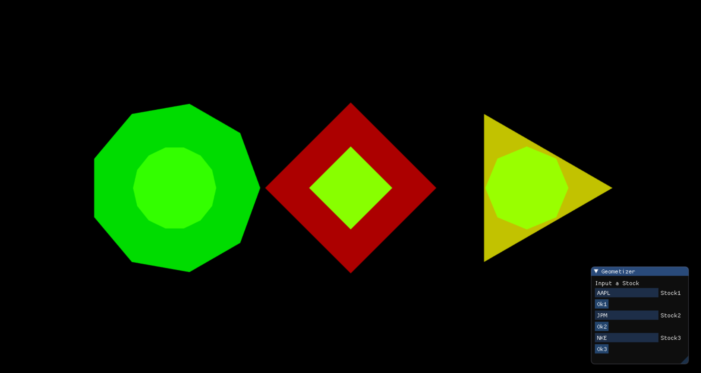
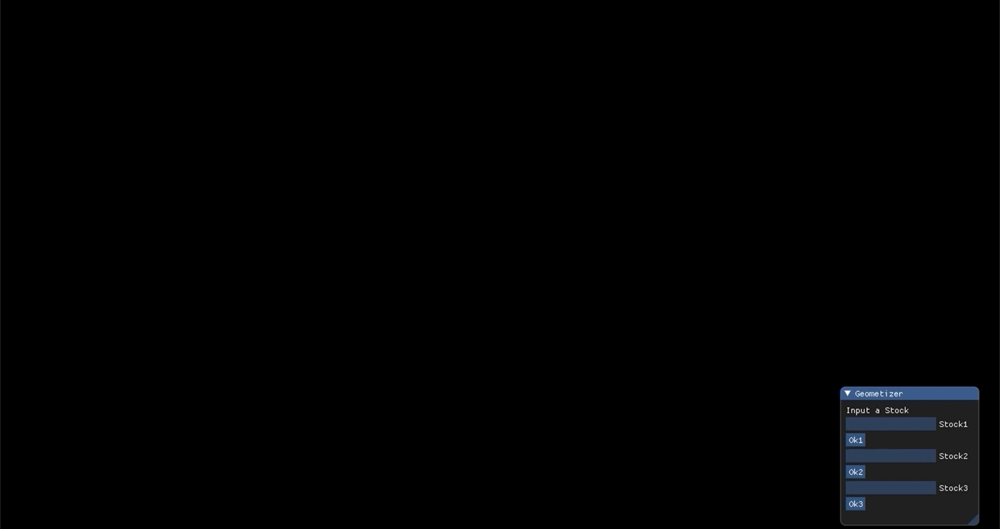

# Stock Geometizer

[](LICENSE)
[](docs/README.md)

**Author**: Eric Jin - [`ericjin2@illinois.edu`](mailto:ericjin2@illinois.edu)

## What is Stock Geometizer?


###### Three stock geometries are created from the window on the bottom right. These shapes are based on financial data from the stock.

Stock Geometizer is a data visualization tool to determine the desirability of stocks. A geometric shape is generated
based on various factors such as buy recommendations, 3 year growth rate, 26 week price return, and others. 

The inner shape and color represent expert advise for the stock while the outer shape represents trends in firm 
performance such as 3 year growth rate. These factors are weighed and scaled to create a wide range of geometry, making
stock data more easy to visualize than ever before.

Compare up to three different stocks using updating financial data to easily inform your investment decisions.

## Usage

### User



Stock Geometizer provides a fast means of visually understanding stocks and to comprehend 
important aspects of a stock as an intuitive reference for people just curious or serious investors. 
From the click of a button, a geometric representation of a stock is 
generated with these informative features:

The more green and the more edges, the more desirable; the more red and 
the less edges, the less desirable. 

Outer Shape - Created based on 3 year growth rate and 26 week price return.

Inner Shape - Created by buy, sell, hold, strong buy, and strong sell recommendations.

### Developer

The amount of geometrical shapes that can be compared can easily be scaled beyond or below the current
three. This is due to abstractions created by numerous helper functions in stock_geometizer.cc.

Formulas on weighing and scaling financial data for geometric features resides in finance_geometry.cc, which
can be changed to modify which financial information is weighed more heavily or how greatly the colors or edges
can vary for example.  

## Building the Project

This was developed on the Mac OS X system and may not work on other platforms. This project uses the Cinder
platform which can be downloaded from: https://libcinder.org/. Once the Cinder folder is downloaded, create the project from
within the Cinder folder. Beyond the general app platform, Cinder is used to dynamically generate geometric 
shapes integral to the data visualization aspect of the app.

External libraries used: Cinder, CPR and OpenSSL, nlohmann/json, and ImGui Cinder Block.

API used: [Finnhub](https://finnhub.io/).

Instructions to integrate these libraries:

### Setting up CPR and OpenSSL

#### OpenSSL

Crucially, CPR does not support it's own Transport Layer Security (TLS), so it can be paired with OpenSSL.
To make requests using OpenSSL, link against libcURL. Do this by adding the following to the CMakeLists.txt:
```c++
find_package(CURL)
include_directories(${CURL_INCLUDE_DIRS})
target_link_libraries(cinder-stockgeoapp ${CURL_LIBRARY})
```
Note: This should be done above CPR integration lines in the CMakeLists.txt file.

#### CPR

[CPR](https://github.com/whoshuu/cpr) is used to make API calls to Finhub for financial data. 

From CPR documentation, it is easiest to add CPR as a submodule using these command in Terminal (for Mac):
```c++
git submodule add https://github.com/whoshuu/cpr.git 
git submodule update --init --recursive
```
In the CMakeList.txt file add this:
```c++
add_subdirectory(submodules/cpr)
include_directories(${CPR_INCLUDE_DIRS})
target_link_libraries(cinder-stockgeoapp ${CPR_LIBRARIES})
```
Then, to use CPR in your project, add this to your source code file:
```c++
#include <cpr/cpr.h>
```

CPR is used primarily for Get requests from the Finnhub API. An example of a Get request used is as follows:
```c++
cpr::Response price_metrics_response = cpr::Get(cpr::Url{kMetricsBeginURL + user_input + kPriceMetricEndURL});
```
These Get requests are called every time the user inputs a new stock and clicks a button to confirm.

### Setting up nlohmann/json

[nlomann/json](https://github.com/nlohmann/json) is used to parse the API JSON response from Finhub.io.

Add the following into your CMakeLists.txt file:
```c++
# JSON Library. Header-only.
FetchContent_Declare(
        nlohmann_json
        URL https://github.com/nlohmann/json/releases/download/v3.7.3/include.zip
)

# Adds nlohmann_json library.
FetchContent_GetProperties(nlohmann_json)
if(NOT nlohmann_json_POPULATED)
    FetchContent_Populate(nlohmann_json)
    add_library(nlohmann_json INTERFACE)
    target_include_directories(nlohmann_json INTERFACE ${nlohmann_json_SOURCE_DIR}/single_include)
endif()

target_link_libraries(cinder-stockgeoapp nlohmann_json)
```
Then, to use nlohmann/json in the project add this to your source code files:

```c++
#include <nlohmann/json.hpp>
```

### Setting up ImGui Cinder Block

ImGui is used primarily as a means to accept user inputs for custom API calls for different stock. Specifically,
the InputText and Button features are mainly used.

Add the following to your CMakeList.txt file:
```c++
# Links ImGui CinderBlock
FetchContent_GetProperties(Cinder-ImGui)
include_directories(igl::opengl_glfw_imgui)
target_link_libraries(cinder-stockgeoapp Cinder-ImGui)
```
Then, use #include to add the Cinder Block path into your source code. This path should lead to the "blocks" folder that 
comes with Cinder.
